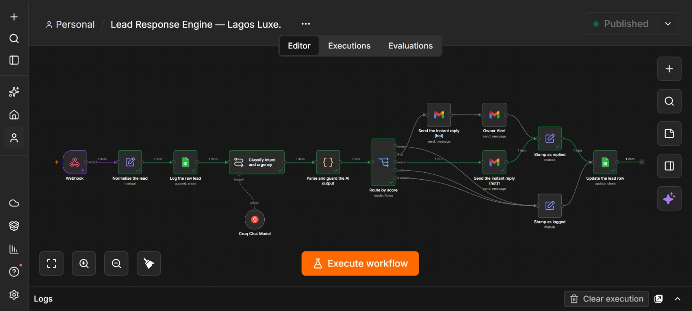

# Lead Response Engine

An n8n lead-response system that captures and stores web enquiries, classifies intent and urgency, sends tailored replies, alerts the owner, and tracks every lead.

## Overview

This project demonstrates an automated lead intake and response process for service businesses.

Every enquiry is stored immediately, analysed, routed, answered, and updated with a clear status. High-intent enquiries also trigger an owner notification.

## The Problem

Businesses often receive enquiries through forms and inboxes but respond only when someone manually checks them.

This creates:

- Slow first-response times
- Lost or forgotten enquiries
- Inconsistent replies
- Poor visibility into lead quality
- No reliable record of the next action

## What the System Does

The system:

1. Receives an enquiry from a public form.
2. Normalises the submitted information.
3. Creates a unique lead ID.
4. Stores the raw enquiry before running AI classification.
5. Classifies intent, urgency, and purchase likelihood.
6. Validates and constrains the AI output.
7. Routes spam, cold, warm, and hot enquiries appropriately.
8. Sends a relevant first response.
9. Alerts the owner when a lead requires immediate attention.
10. Updates the original Google Sheets row with the final result and status.

## Workflow Architecture

The public form sends a structured request to an n8n production webhook.

The workflow then:

- Normalises the form data
- Stores the enquiry in Google Sheets
- Sends the message to the AI classifier
- Validates the model output
- Routes the enquiry
- Sends the appropriate Gmail response
- Notifies the owner when necessary
- Updates the matching row using the unique lead ID

## Key Design Decision

The enquiry is stored before the AI model runs.

If the model fails, returns malformed data, or becomes temporarily unavailable, the original lead is still preserved. A model failure may delay classification, but it cannot cause the business to lose the enquiry.

The system also validates and defaults the model output instead of trusting it automatically.

## Verified Result

During end-to-end testing, the system produced a useful first response in under 60 seconds while preserving and updating the original lead record.

## Failure Handling

The workflow protects against:

- Missing form fields
- Malformed AI output
- Scores outside the accepted range
- Duplicate enquiries
- AI classification failures
- Incorrectly formatted phone numbers
- Spam submissions

Phone numbers are stored as text so leading zeroes and international `+` symbols are preserved.

## Tech Stack

- n8n
- Google Sheets
- Gmail
- AI classification
- JavaScript
- Webhooks
- JSON

## Screenshots

### Workflow Canvas

## Demo

Recorded walkthrough coming shortly.

## Repository Contents

- `lead-response-engine.json` — sanitised n8n workflow export
- `screenshots/workflow-canvas.png` — complete workflow architecture

## Scope

Automated follow-up and inbound reply detection are not included in this public version. The current system focuses on safe capture, classification, first response, owner notification, and lead-status tracking.

## Security

Credentials, API keys, personal information, account identifiers, and live webhook URLs have been removed from the public workflow export.

Anyone importing the workflow must connect their own accounts and replace the placeholder values.

## Status

Completed and tested as a portfolio demonstration. The workflow can be adapted to a business’s enquiry types, routing rules, response templates, and notification process.
